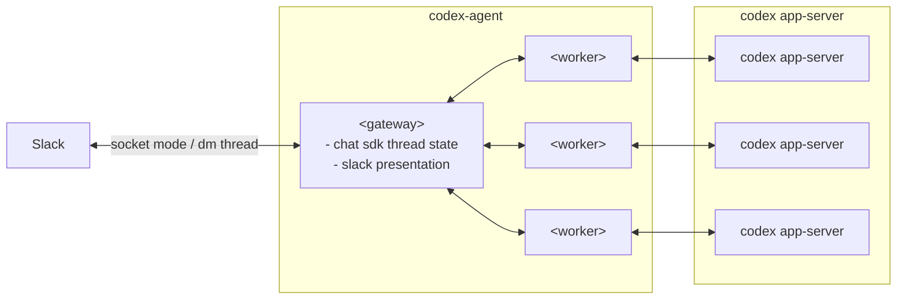

# Architecture Overview

このドキュメントは、現時点の合意済みアーキテクチャを俯瞰するための概要メモ。

## Top-level structure

- `gateway`: 外部チャネルとの境界
- `worker`: 実行バックエンドとの境界

## Overview Diagram

## Notes

- `codex-agent` の内部構成は `gateway / worker` の2区分で捉える
- `gateway` は Chat SDK thread を起点に、routing と presentation を持つ
- conversation の最小状態は Chat SDK `thread.state` が owner
- `worker` は複数インスタンスを取りうる内部境界として扱う
- `codex app-server` は `worker` の内部ではなく外部システムとして扱う
- 図中の複数 `worker` / `codex app-server` は多重性の表現であり、固定の 1:1 対応を意味しない
- 線の意味は一律ではなく、`Slack <--> gateway`、`gateway <--> worker`、`worker <--> codex app-server` は協調関係を表す
