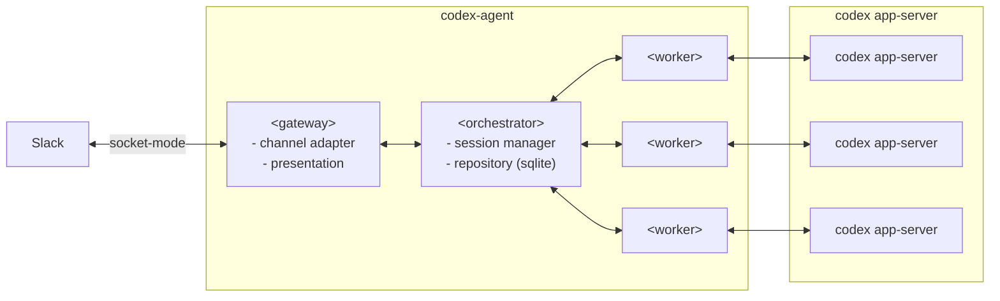

# Architecture Overview

このドキュメントは、現時点の合意済みアーキテクチャを俯瞰するための概要メモ。

## Top-level structure

- `gateway`: 外部チャネルとの境界
- `orchestrator`: session / conversation の進行管理
- `worker`: 実行バックエンドとの境界

`repository` は独立トップレベルではなく、`orchestrator` の内部詳細として扱う。

## Overview Diagram

## Notes

- `codex-agent` の内部構成は `gateway / orchestrator / worker` の3区分で捉える
- `gateway` は `channel adapter + presentation` として捉える
- `channel adapter` の中に runtime と coordination を含める
- `orchestrator` が session state と persistence の owner
- `worker` は複数インスタンスを取りうる内部境界として扱う
- `codex app-server` は `worker` の内部ではなく外部システムとして扱う
- 図中の複数 `worker` / `codex app-server` は多重性の表現であり、固定の 1:1 対応を意味しない
- 線の意味は一律ではなく、`Slack <--> codex-agent` と `gateway <--> orchestrator`、`orchestrator <--> worker`、`worker <--> codex app-server` は協調関係を表す
