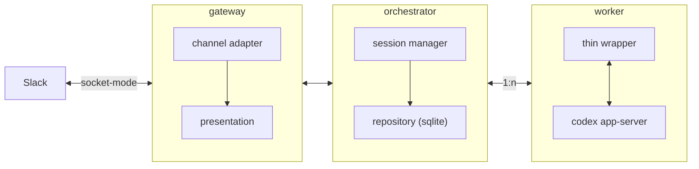

# Architecture Overview

このドキュメントは、現時点の合意済みアーキテクチャを俯瞰するための概要メモ。

## Top-level structure

- `gateway`: 外部チャネルとの境界
- `orchestrator`: session / conversation の進行管理
- `worker`: 実行バックエンドとの境界

`repository` は独立トップレベルではなく、`orchestrator` の内部詳細として扱う。

## Overview Diagram

## Notes

- `gateway` は `channel adapter + presentation` として捉える
- `channel adapter` の中に runtime と coordination を含める
- `orchestrator` が session state と persistence の owner
- `worker` は Codex app-server に対する薄い wrapper として扱う
- 線の意味は一律ではなく、`Gateway <--> Orchestrator` と `Orchestrator <--> Worker` は協調関係、`session manager --> repository` は依存関係を表す
