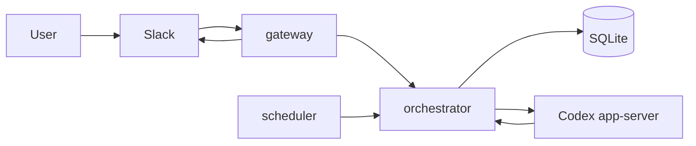
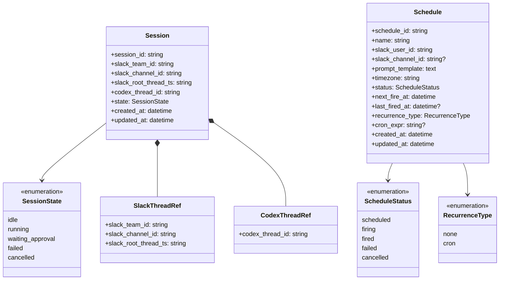
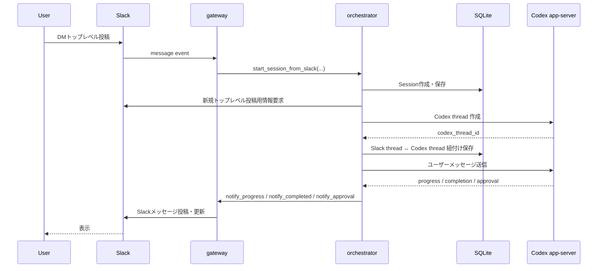
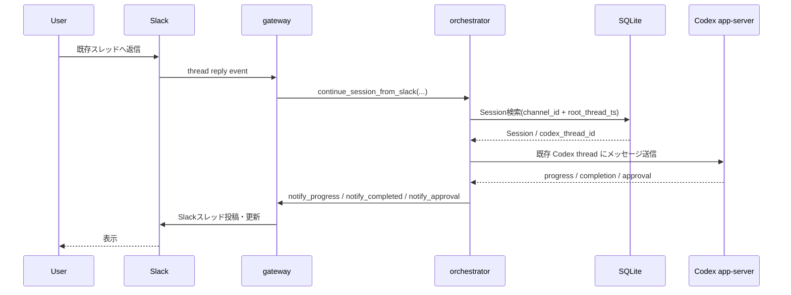
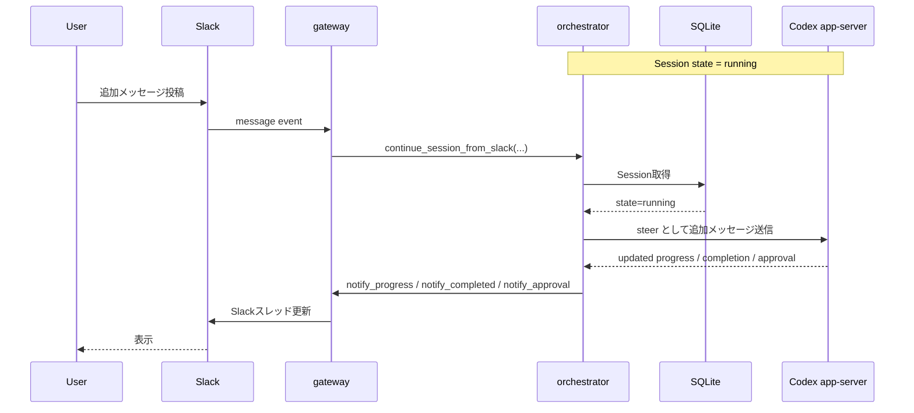
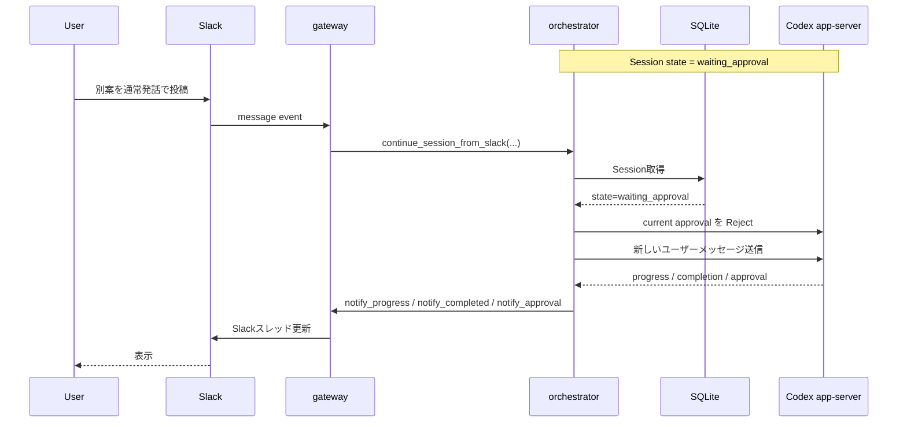
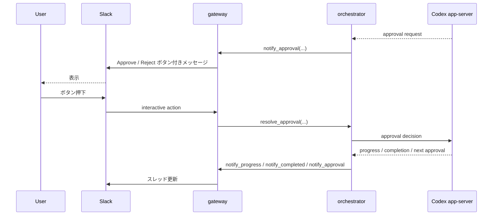
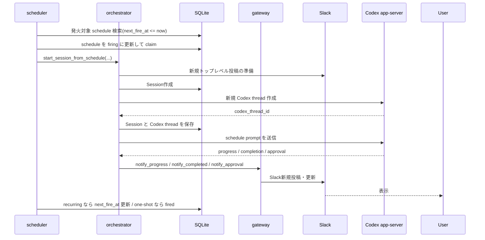

# Mermaid Diagrams

## 1. Architecture Diagram

---

## 2. Domain Model Diagram

---

## 3. Sequence Diagram: New Session from Slack DM

---

## 4. Sequence Diagram: Continue Existing Session from Slack Thread Reply

---

## 5. Sequence Diagram: Running Session with Additional Message (Steer)

---

## 6. Sequence Diagram: Waiting Approval with Additional Message (Reject + New Message)

---

## 7. Sequence Diagram: Approval Button Flow

---

## 8. Sequence Diagram: Scheduled Session Start

